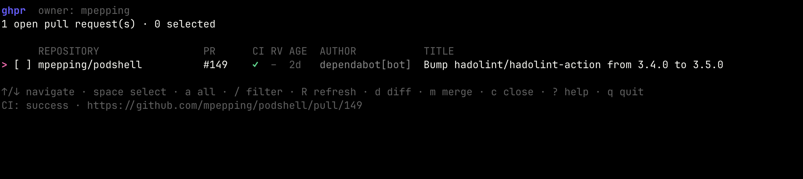

# ghpr

`ghpr` is a terminal UI for reviewing and managing open pull requests across repositories owned by a GitHub user or organization.

<p align="center">
  
</p>

## Features

- Find open pull requests across all non-archived repositories owned by a GitHub account, or scope the search to reviews requested from you.
- Select one or many pull requests in a terminal UI.
- Show merge readiness at a glance: CI / checks status, review decision, merge conflicts, age and author.
- Filter the list by repository, title, author or number without reloading.
- Refresh the list and all statuses from GitHub without restarting.
- View the highlighted pull request's colorized diff in a built-in pager, with search and file-to-file navigation.
- Open the highlighted pull request on GitHub in the default browser.
- Approve and merge selected pull requests, using squash, merge commit or rebase.
  - `ghpr` first tries to enable GitHub auto-merge.
  - If auto-merge is unavailable, it attempts a direct merge.
- Approve without merging, request changes, comment, update the branch from its base, or close.
- Keep processing a batch when an individual pull request fails, reporting each result as it happens.
- Preview any action with `--dry-run` before running it for real.
- Works against GitHub Enterprise Server.

> [!WARNING]
> Merge and close are destructive actions. Take time to review PR's. Use `--dry-run` when in doubt.


## Installation

### Homebrew

Once a release is available:

```sh
brew install mpepping/tap/ghpr
```

### Go

Go 1.26.1 or newer is required.

```sh
go install github.com/mpepping/ghpr/cmd/ghpr@latest
```

### From source

```sh
git clone https://github.com/mpepping/ghpr.git
cd ghpr
make build
./ghpr --help
```

## Authentication

`ghpr` first reads the token for the active account on the target host from the GitHub CLI `hosts.yml` file. The path is resolved in this order:

1. `$GH_CONFIG_DIR/hosts.yml`
2. `$XDG_CONFIG_HOME/gh/hosts.yml`
3. `$HOME/.config/gh/hosts.yml`

Both the current multi-account format and the legacy `oauth_token` format are supported. The `gh` executable is not invoked.

Only when `hosts.yml` does not exist, `ghpr` falls back to `GH_TOKEN` and then `GITHUB_TOKEN`:

```sh
export GH_TOKEN="github_pat_..."
ghpr
```

If an existing `hosts.yml` is malformed or has no token for the active user on the target host, `ghpr` reports the configuration error instead of silently using another credential.

For private repositories, the token must be able to read those repositories. Approving, merging, commenting, and closing also require the corresponding pull-request, contents, and issues write permissions. A classic personal access token normally needs the `repo` scope.

When `--owner` is omitted, `ghpr` uses the login associated with the selected token.

### GitHub Enterprise Server

Pass `--host`, or set `GH_HOST`, to target an Enterprise instance. The token is then read from that host's entry in `hosts.yml`.

```sh
ghpr --host github.example.com --owner platform-team
```

## Usage

```text
Usage: ghpr [options]

Options:
  -delete-branch
        delete the head branch after a direct merge
  -dry-run
        show what every action would do without changing anything on GitHub
  -filter string
        start the terminal UI with this filter applied
  -host string
        GitHub host, for GitHub Enterprise Server (default github.com)
  -json
        print the pull requests as JSON and exit instead of starting the UI
  -limit int
        maximum number of open pull requests to load (1-1000) (default 1000)
  -merge-method string
        merge strategy: squash, merge or rebase (default "squash")
  -no-color
        disable colored output
  -owner string
        GitHub user or organization that owns the repositories
  -scope string
        which pull requests to load: owned, review-requested, involved or authored (default "owned")
  -version
        print version information and exit
```

Examples:

```sh
# Repositories owned by the authenticated user
ghpr

# Repositories owned by a specific user or organization
ghpr --owner mpepping

# Everything waiting for your review, anywhere on GitHub
ghpr --scope review-requested

# Start focused on Dependabot pull requests, and rebase instead of squashing
ghpr --owner mpepping --filter dependabot --merge-method rebase

# See what a bulk merge would do, without touching anything
ghpr --owner mpepping --dry-run
```

### Scopes

| Scope              | Pull requests loaded                                              |
| ------------------ | ----------------------------------------------------------------- |
| `owned` (default)  | Open pull requests in repositories owned by `--owner`             |
| `review-requested` | Open pull requests where your review has been requested           |
| `involved`         | Open pull requests you authored, commented on, or were mentioned in |
| `authored`         | Open pull requests you opened                                     |

`owned` requires an owner. The other scopes work without one, and accept `--owner` as an extra filter.

### Configuration file

Defaults may be set in `~/.config/ghpr/config.yml` (or `$GHPR_CONFIG`, or `$XDG_CONFIG_HOME/ghpr/config.yml`). Command line flags always win. Unknown keys are reported as errors rather than silently ignored.

```yaml
owner: mpepping
limit: 200
scope: owned
merge_method: squash
delete_branch: false
host: github.com
filter: ""
no_color: false
editor: nvim
```

### Scripting

`--json` prints the pull requests, including merge readiness, and exits without starting the UI:

```sh
# Everything that is ready to merge
ghpr --json | jq '.[] | select(.blocked == false and .draft == false) | .url'

# Group the backlog by repository
ghpr --json | jq -r '.[].repository' | sort | uniq -c | sort -rn
```

Each record looks like this:

```json
{
  "repository": "mpepping/ghpr",
  "number": 12,
  "title": "Skip approval on self-created PRs",
  "url": "https://github.com/mpepping/ghpr/pull/12",
  "author": "mpepping",
  "draft": false,
  "updatedAt": "2026-07-31T10:00:00Z",
  "checks": "success",
  "review": "approved",
  "mergeable": "mergeable",
  "blocked": false
}
```

### TUI keys


Press `?` in the UI for the same list.

| Key                  | Action                                              |
| -------------------- | --------------------------------------------------- |
| `↑` / `↓`, `j` / `k` | Navigate                                            |
| `g` / `G`            | Jump to the first or last pull request              |
| `space`              | Select or deselect the current pull request         |
| `a`                  | Select or deselect all *visible* pull requests      |
| `/`                  | Filter the list                                     |
| `esc`                | Clear the active filter                             |
| `R` / `ctrl+r`       | Reload pull requests and statuses from GitHub       |
| `d`                  | Open the highlighted pull request's diff            |
| `w`                  | Open the highlighted pull request in a browser      |
| `L`                  | Show the session log                                |
| `?`                  | Show help                                           |
| `m`                  | Approve and merge selected pull requests            |
| `A`                  | Approve selected pull requests without merging      |
| `c`                  | Close selected pull requests                        |
| `r`                  | Request changes on selected pull requests           |
| `C`                  | Comment on selected pull requests                   |
| `u`                  | Update selected branches from their base            |
| `y` / `enter`        | Confirm an action                                   |
| `n` / `esc`          | Cancel a prompt                                     |
| `q`                  | Quit                                                |

In a message prompt, `enter` inserts a newline, `ctrl+d` accepts the message, and `ctrl+e` opens `$EDITOR` (or `editor:` from the config file) to compose it.

### Columns

```text
      REPOSITORY                 PR      CI RV AGE  AUTHOR           TITLE
> [x] mpepping/ghpr              #12     ✓  ✓  2h   mpepping         Skip approval on self-created PRs
  [ ] mpepping/docker-jitsi-meet #340    ✗  ⚠  3d   dependabot[bot]  Bump alpine from 3.19 to 3.20 in /base
```

`CI` is the status-check rollup for the latest commit:

| Glyph | Meaning                   |
| ----- | ------------------------- |
| `✓`   | All checks passed         |
| `…`   | Checks are still running  |
| `✗`   | At least one check failed |
| `?`   | Status could not be read  |
| `–`   | No checks configured      |
| `·`   | Still loading             |

`RV` is merge readiness. A merge conflict outranks the review decision, because it blocks the merge regardless of approvals:

| Glyph | Meaning                                 |
| ----- | --------------------------------------- |
| `⚠`   | Conflicts with the base branch          |
| `✓`   | Approved                                |
| `✗`   | Changes requested                       |
| `○`   | Review required by branch protection    |
| `–`   | No review decision (no protection rule) |
| `·`   | Still loading                           |

`AGE` is the time since the pull request was last updated; anything older than 30 days is highlighted. The `AGE` and `AUTHOR` columns are dropped automatically on narrow terminals.

Every status is encoded as a distinct glyph as well as a color, so the UI stays readable with `--no-color`, with `NO_COLOR` set, and for colorblind users.

### Filtering

Press `/` and type to narrow the list as you type. Terms are matched case-insensitively against the repository, pull request number, title and author, and multiple terms are combined with AND:

```text
/dependabot go      # Dependabot pull requests mentioning "go"
/ghpr               # everything in the ghpr repository
/#42                # pull request number 42
/draft              # draft pull requests
```

`enter` keeps the filter active, `esc` cancels the edit, and `esc` in the list clears an active filter. `a` selects only the pull requests that currently pass the filter, which makes "filter, select all, merge" a safe bulk workflow. Selections are kept when the filter changes, so you can build a selection across several filters before acting.

### Diff viewer

| Key             | Action                     |
| --------------- | -------------------------- |
| `space`, `pgdn` | Page down                  |
| `pgup`          | Page up                    |
| `↑` / `↓`       | Scroll line by line        |
| `/`             | Search the diff            |
| `n` / `N`       | Next / previous match      |
| `]` / `[`       | Next / previous file       |
| `w`             | Open the pull request      |
| `esc`, `q`      | Back to the pull request list |

Diffs are cached for the session, so reopening one is instant; a refresh clears the cache. Diffs larger than 2 MB are truncated with a notice.

### Batches

Actions apply to the whole selection. While a batch runs, `ghpr` reports each pull request as it completes, so a long run shows live progress (`2/17`), the item currently being processed, and any failures as they occur. A failure never stops the rest of the batch, and failed pull requests stay selected so they can be retried.

The confirmation prompt lists the pull requests that are about to change and warns when any of them have failing checks, conflicts or requested changes.

Press `L` afterwards for the full session log, which keeps every result and error message.

### Rate limits

GitHub's search and GraphQL APIs are rate limited. `ghpr` loads statuses in batches, and automatically waits and retries when GitHub reports a primary or secondary rate limit. Rate limit, permission and authentication errors are reported in plain language rather than as raw HTTP status codes.

## Notes

GitHub does not allow users to review their own pull requests. `ghpr` therefore skips the approval step for pull requests you authored yourself and merges them directly. Approving or requesting changes on your own pull request is reported as a per-item failure and the pull request remains selected.

`--delete-branch` only applies to a direct merge. When GitHub auto-merge is enabled, the merge happens later and the repository's own "automatically delete head branches" setting decides. Branches on forks are never deleted.

## Development

```sh
make fmt
make test
make lint
make build
```

## License

MIT
